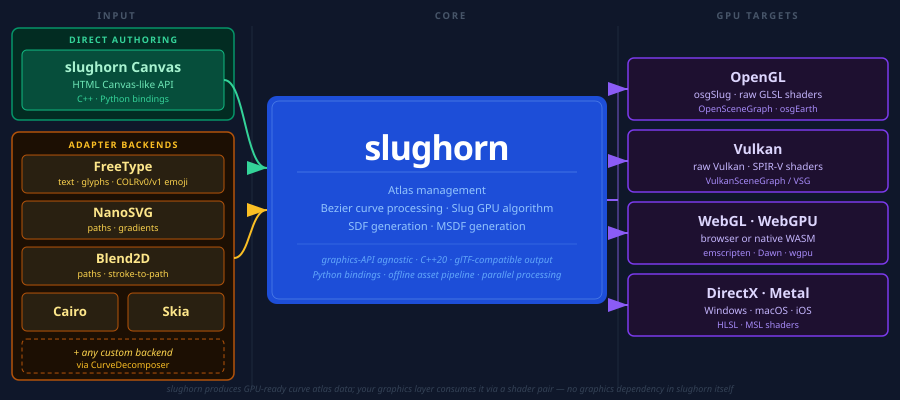

<table border="0">
<tr>
<td><picture>
  <source media="(prefers-color-scheme: light)" srcset="ext/logo.svg">
  
</picture></td>
<td>

https://github.com/user-attachments/assets/5ca6563e-a7d3-44df-9800-beb8716efcad

</td>
</tr>
</table>

# slughorn

---

<div align="center">

**🔨 What We're Working On** &nbsp;&nbsp;<sub>*Last updated: August 1st, 2026*</sub>

| | Feature | Status |
|:---:|---------|:------:|
| 🧰 | **Remove** the `expand` parameter as CPU-side "hack" |  |
| 🎨 | Full Porter-Duff compositing and blend mode support |  |
| 🎭 | MSDF and procedurally-based `CompositeShape` masking |  |
| 🔧 | Improved Blend2D and NanoSVG feature support |  |

</div>

## Related Projects

- [osgSlug](https://github.com/AlphaPixel/osgSlug)
- [osgGLTF](https://github.com/XenonofArcticus/osgGLTF)
- [OpenSceneGraph.py](https://github.com/AlphaPixel/OpenSceneGraph.py/tree/cubicool-wip)

---

<div align="center">

[](https://slughorn.io)
[](https://slughorn.io/UserGuide.pdf)
[](https://slughorn.io/WhatsNext.pdf)

</div>

`slughorn` is modern C++20 library implementing the recent OSS release of the
"Slug" GPU vector graphics rendering technique by [Eric Lengyel](https://terathon.com/blog/).
It makes no assumptions about what graphics environment is being used (OpenGL,
Vulkan, WebGL, WebGPU, DirectX, etc) and instead focuses *only* on simplifying
the process of creating/ingesting vector data from various backends--or,
alternatively, by using an HTML "Canvas-like" API directly in code--so it can be
directly uploaded to the GPU as easily as possible. A backend is simply an
implementation that produces Bezier curves for `slughorn` to process to
facilitate drawing. Further code outside of `slughorn` draws the curves with a
graphics API like OpenGL, Vulkan, WebGL, WebGPU, Metal, DirectX or similar,
potentially using toolkits like but not limited to OSG / OpenSceneGraph or VSG /
VulkanSceneGraph. Companion projects ( https://github.com/AlphaPixel/osgSlug )
assist with this integration.

Furthermore, `slughorn` provides tools for traditional "offline asset"
processing (primarily in Python), as well as a [glTF](#)-compatible JSON file
format.

# Architecture

`slughorn` operates in two complementary modes. As a **first-class authoring tool**,
it provides a Canvas-like API for building vector content directly in code — shapes,
text, gradients, and composited layers — all flowing into the GPU atlas without any
intermediate library. As an **adapter**, it bridges existing vector ecosystems (Cairo,
Skia, Blend2D, NanoSVG, FreeType) into that same GPU-ready pipeline, letting you keep
your current authoring workflow while gaining resolution-independent,
perspective-correct GPU rendering. Most GPU vector renderers want to own the authoring;
`slughorn` is being developed to support *bringing your own*.

The divison is basically: `slughorn` is the "unified source of truth", providing
data and hints/constraints about **how** that data is used; your *frontend*
decides what **do** with it.

<div align="center">

<picture>
  <source media="(prefers-color-scheme: light)" srcset="ext/architecture-light.svg">
  
</picture>

</div>

# Current Supported Backends

- FreeType
- NanoSVG (paths & gradients)
- Skia (paths only, stroke-to-path)
- Cairo (paths only)
- Blend2D (paths only, stroke-to-path)

In addition to the above backends, `slughorn` provides a "native" API for
authoring vector graphics inspired by the standard HTML `Canvas` element.

Adding support for other backends is generally as easy as using a single helper
class: `slughorn::CurveDecomposer`. If your vector data can be reduced into
simple quadratic Bezier curves, `slughorn` can make it render.

> Supporting *most* of the missing Skia/Cairo/Blend2D features (gradients,
> patterns, text, clipping/masking) is entirely **possible**, it just requires
> time/effort. As slughorn continues to evolve, so will those backends.

# Demos

<table>
<tr>
<th align="center">Preview</th>
<th>Description</th>
</tr>

<tr>
<td align="center">


</td>
<td>

**Emoji**

Demonstrates loading **COLRv0** and **COLRv1** emojis using the `slughorn/freetype.hpp`
backend. Each layer of the emoji is composited into its own quad and positioned relative
to the base.

slughorn supports all of the advanced **COLRv1** features, including gradients
and transforms.

</td>
</tr>

<tr>
<td align="center">

[](https://slughorn.io/github/pbr-ibl.webm)

</td>
<td>

**PBR/IBL**

Full PBR (Physics Based Rendering) and IBL (Image Based Lighting) can be applied
to any shape. This video shows the standard `chromatic.hdr` file (converted to KTX2)
applied to a text scene using high metallic/low roughness settings.

</td>
</tr>

<tr>
<td align="center">

[](https://slughorn.io/github/glyph-animate.webm)

</td>
<td>

**Animated Glyphs**

Simple, shader-driven animation applied to Slug-rendered glyph geometry,
accomplished by adjusting the output positions in the vertex shader.

</td>
</tr>

<tr>
<td align="center">

[](https://slughorn.io/github/logo.webm)

</td>
<td>

**Layer Effects**

Shows how individual layers in a `CompositeShape` can not only be distinguished in the
shader pipeline, but also how each layer can have its own unique fragment output. From
left to right: basic fill, two GLSL algorithmic fills, traditional texture lookup, and
finally an animated GLSL algorithmic fill.

</td>
</tr>

<tr>
<td align="center">

[](https://slughorn.io/github/morph.webm)

</td>
<td>

**Morphing**

Similar to the animated glyphs demo, this example shows both the shape, a simple
triangle, and the debugging bounding box using the `OSGSLUG_DEBUG=3` environment
variable.

</td>
</tr>

<tr>
<td align="center">


</td>
<td>

**2D Projection**

The standard orthographic-style 2D placement/rendering.

</td>
</tr>

<tr>
<td align="center">


</td>
<td>

**3D Projection**

The same scene as the 2D Projection above, but with a traditional perspective-style view.

</td>
</tr>

<tr>
<td align="center">


</td>
<td>

**Gradients**

The FreeType, NanoSVG and Canvas backends all fully support linear, radial and
sweep gradient fills/strokes. Gradients can also be dynamically transformed by
the GPU during rendering (though their "color stop" values are static).

</td>
</tr>

<tr>
<td align="center">


</td>
<td>

**Masking**

Every `CompositeShape` supports its own `slughorn::Mask`, which can be either a
procedurally generated shape or any arbitrary `slughorn::Shape`. Mask
"inversion" is also supported.

</td>
</tr>

<tr>
<td align="center">


</td>
<td>

**HUD**

slughorn is perfect for HUD elements of any kind in 2D, 3D, or somewhere
dynamically in between.

</td>
</tr>

<tr>
<td align="center">

[](https://slughorn.io/github/animated-hud.webm)

</td>
<td>

**Animated HUD**

Every `Layer` instance within a `CompositeShape` can be individually accessed
and dynamically modified. When using the *GL4/SSBO* path, updates only require
changing a small subset of the total GPU memory.

</td>
</tr>

<tr>
<td align="center">


</td>
<td>

**Shapes/CompositeShapes**

Each backend has its own examples of how to create both simple `Shape` and
`CompositeShape` objects, groups of `Shape` instances layered together. The last
screenshot demonstrates the `slughorn/canvas.hpp` backend, in addition to showing how
the traditional punch-out effect can be achieved by manually using opposite winding
directions in order to cut out one closed path from another.

</td>
</tr>

<tr>
<td align="center">

[](https://slughorn.io/github/shapes-compositeshapes-mixed.webm)

</td>
<td>

**Mixed Scenes**

`Shape` instances from different backends can be mixed together in the same
`CompositeShape`; for example, fonts from the FreeType backend mixed with
hand-authored content from the native Canvas (to create an animated "card"
mockup, seen here).

</td>
</tr>

<tr>
<td align="center">

[](https://slughorn.io/github/shapes-compositeshapes-animation.webm)

</td>
<td>

**Animated Scenes**

A `CompositeShape` scene can reference and animate any of the participating
`Shape` instances within it. In this example, a single "pill" shape is repeated
12 times, each being animated using a different time offset.

</td>
</tr>

<tr>
<td align="center">

[](https://slughorn.io/github/sphere3d.webm)

</td>
<td>

**3D Objects**

Slug is not restricted to simple quads; any 3D object or mesh can be assigned compatible
`slughorn` coordinate mappings, such as spheres, cubes, curved surfaces, etc.

</td>
</tr>

<tr>
<td align="center">


</td>
<td>

**SVG**

SVG content fits easily within the `slughorn` ecosystem via the `slughorn/nanosvg.hpp`
backend.

*NOTE*: Some SVG features (strokes, text) are **possible**, but have not yet
been implemented.

</td>
</tr>

<tr>
<td align="center">

[](https://slughorn.io/github/text.webm)

</td>
<td>

**Text**

Text was the original inspiration for Slug, and will always be incredibly well-supported.
As mentioned above, each glyph in a text layout is nothing more than an instance of
`Shape`, and can be manipulated in any way you can imagine. :)

</td>
</tr>

<tr>
<td align="center">

[](https://slughorn.io/github/text-mix.webm)

</td>
<td>

**Mixed Text**

Text glyphs are simply an instance of `Shape`, and can be freely mixed with any
**other** `Shape` or `CompositeShape` object. This example demonstrates replacing the
character `F` with a simple triangle, which fits seamlessly into the layout process.

</td>
</tr>

<tr>
<td align="center">


</td>
<td>

**Text Effects**

Emphasizing that glyphs truly **are** "just another `Shape`", this example
demonstrates using "inside" *and* "outside" coverage effects (using MSDF sidecar
data), stroking instead of filling, as well a using procedural GLSL to actively
remove sections of a normal glyph fills!

</td>
</tr>

<tr>
<td align="center">


</td>
<td>

**Text Along Path**

Individual glyphs can be easily positioned along existing `Path` instances. The
`slughorn::canvas::Path` object can `sample` at **any position** within a
supported `Shape` instance.

</td>
</tr>

<tr>
<td align="center">

[](https://slughorn.io/github/compute.webm)

</td>
<td>

**Compute Shaders**

Not only can compute shaders animate/manipulate `slughorn` state, they can also
act as a `fill()` source for other content. This demonstrates two stacked,
blended shapes each using different compute shader output.

</td>
</tr>

</table>

> **Note on demos:** All video demonstrations above are captured from
> [osgSlug](https://github.com/AlphaPixel/osgSlug), the intentionally separate
> OpenSceneGraph-based testbed developed alongside `slughorn`. `slughorn` itself
> has no graphics dependencies, and `osgSlug` exists to prove the integration
> story and serve as a reference implementation for other graphics backends.

# Skia

## Compilation

```
cd ~/dev/skia
rm -rf out/Release
bin/gn gen out/Release
ninja -C out/Release skia
```

## Why Slug Instead of Skia's GPU Backend?

### What Skia Actually Does on the GPU

Skia has two GPU backends: **Ganesh** (the older one, OpenGL/Vulkan/Metal) and
**Graphite** (the newer one, designed for modern explicit APIs). Both work by:

1. **Tessellating** paths into triangles on the CPU (or via compute shaders)
2. Uploading those triangles to the GPU
3. Rendering with relatively simple shaders

The key word is *tessellation*; Skia converts your curves into triangle meshes.
This means:

- Quality is **resolution-dependent**; you have to choose a tessellation
  tolerance, and if you zoom in far enough you'll see faceting
- Every time the path **transforms** (scale, rotation, perspective), you either
  re-tessellate or accept quality loss
- **Perspective projection** of curves is fundamentally broken with
  tessellation; a cubic Bezier projected through a perspective matrix is no
  longer a cubic Bezier

### What Slug Does Differently

Slug evaluates the **exact curve equations per-fragment** in the shader. This
means:

- Quality is **resolution-independent**; zoom in infinitely, edges stay perfect
- Transforms are **free**; the vertex shader handles them, the fragment shader
  doesn't care
- **Perspective is correct**; because you're evaluating the curve at each
  pixel, not approximating it with triangles
- No CPU tessellation step; the atlas is built once and never rebuilt
  regardless of transform

### Comparison

| | Skia GPU | Slug |
|---|---|---|
| Edge quality at scale | Depends on tolerance | Perfect always |
| Perspective correctness | Approximate | Exact |
| CPU work per frame | Re-tessellate on change | Nothing |
| GPU fragment cost | Cheap (just triangles) | More expensive |
| Setup complexity | High (full GPU framework) | Moderate |
| OSG integration | Very difficult | Natural |

### OSG Integration Specifically

Getting Skia's GPU backend working inside OSG would be genuinely painful:

- Skia wants to **own the OpenGL context**; it manages its own state, its own
  FBOs, its own texture atlases. OSG also wants to own the context. Getting them
  to share without stomping each other's state is a known headache.
- Skia's GPU API is **not designed to be embedded**; it's designed to be the
  renderer, not a component of one.
- You'd essentially be running two renderers side by side and compositing, which
  introduces synchronization, blending, and depth buffer problems.

Slug, on the other hand, is just **a shader and two textures**; it slots into
OSG's existing pipeline as naturally as any other `osg::Program`.

### The Real Answer to "Are You Reinventing It?"

For **2D UI / document rendering at fixed resolution**; Skia is better. It's
battle-hardened, handles edge cases you haven't thought of yet, and the
tessellation quality is fine for screen-resolution work.

For **3D scene graph rendering with arbitrary transforms and perspective**,
Slug is genuinely superior. The moment you want text or shapes on a billboard, a
HUD, a curved surface, or viewed through a perspective camera, Skia's approach
starts showing cracks and Slug's approach shines.

Slug is solving a different problem that Skia deliberately doesn't address.

# AI Disclosure Declaration

AI tools such as Codex and Claude have been used for research and some code
development. However, this is not a "fire and forget" AI project. It was
carefully designed, planned, architected and implemented by a live human
(cubicool@gmail.com). AI tools were also used for producing documentation and
ancillary data products to accelerate development.

# Sponsorship

This project grew out of internal research and experimentation at AlphaPixel
([AlphaPixelDev.com](https://alphapixeldev.com/)) based on the 2026 release
of the Slug algorithm (https://terathon.com/blog/decade-slug.html) patent
by its author, Eric Lengyel, for whom the whole Slug-using community is
extremely grateful.

If you are interested in assistance with Slug, slughorn, OpenGL, OpenSceneGraph,
Vulkan, VulkanSceneGraph, AR, VR, xR, 3d mapping, or almost any other
performance-centric computing, please contact AlphaPixel. We are mercenary
programmers who can provide rapid assistance to any challenge, and our motto is
"We Solve Your Difficult Problems."
